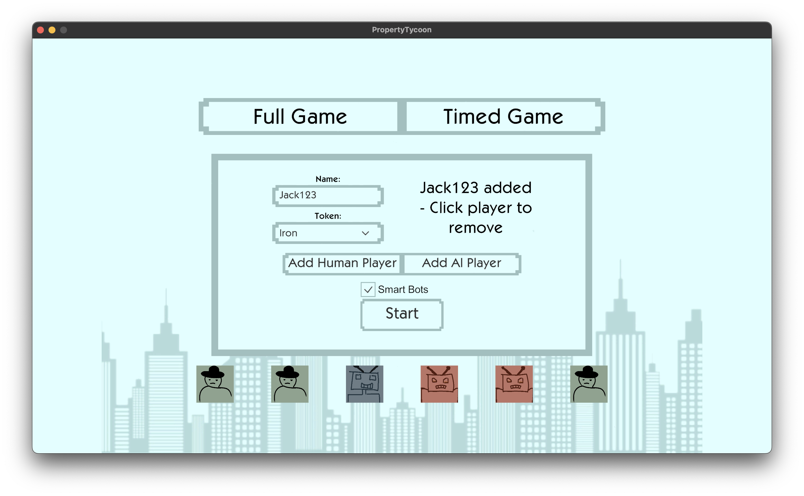
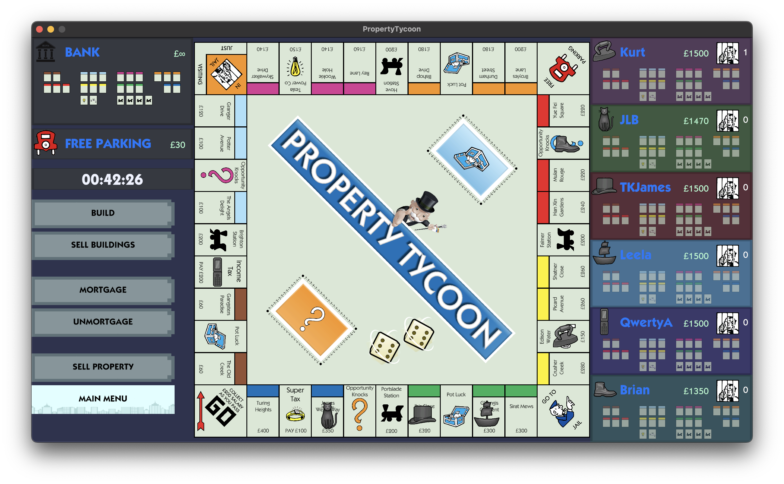
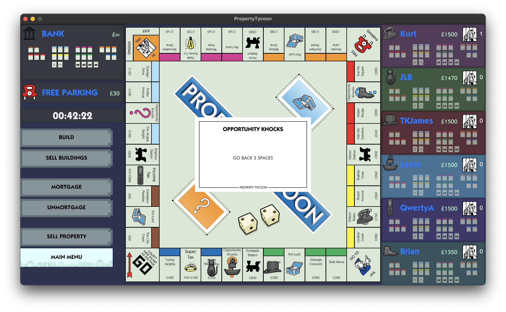
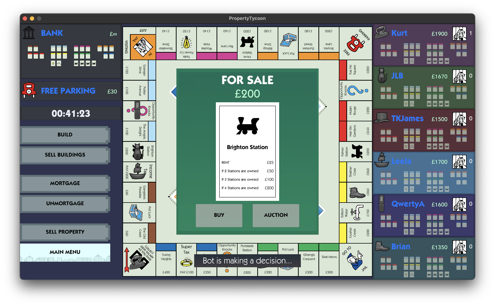
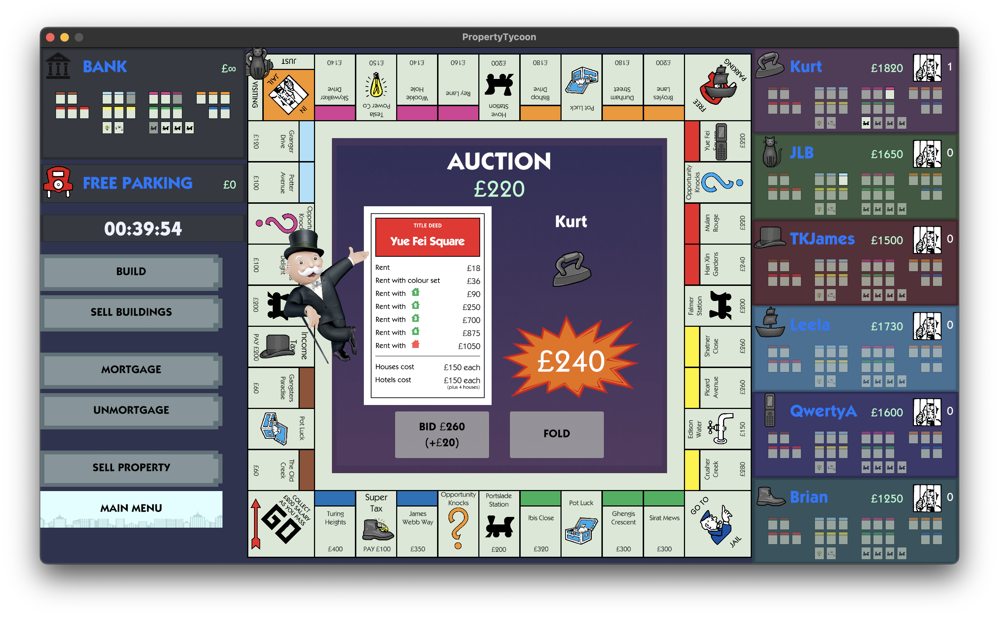
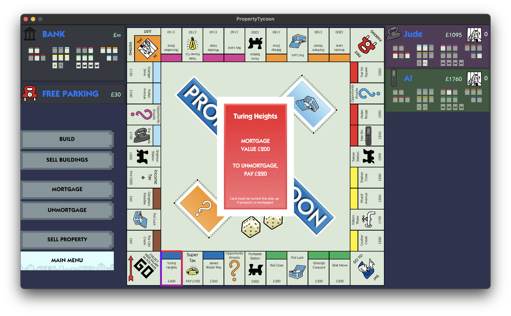
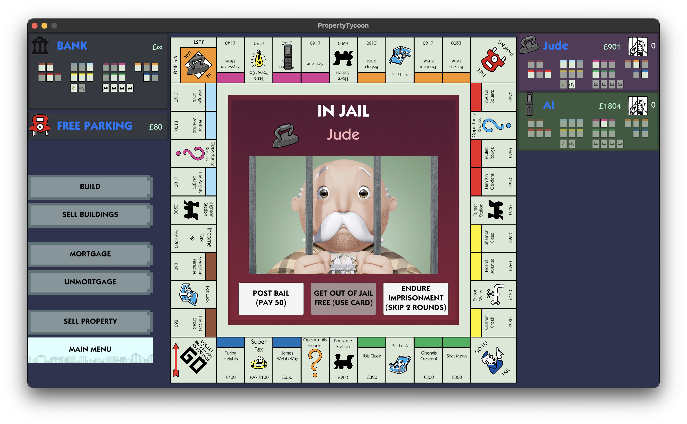
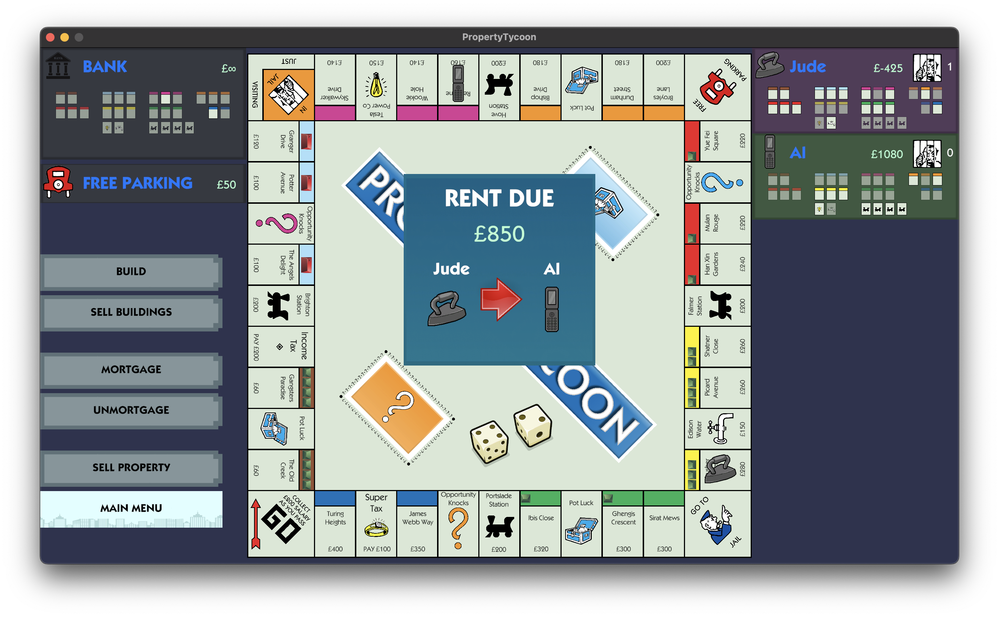
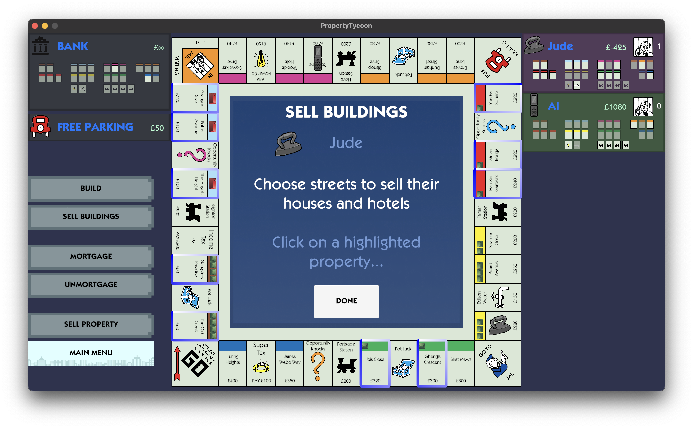
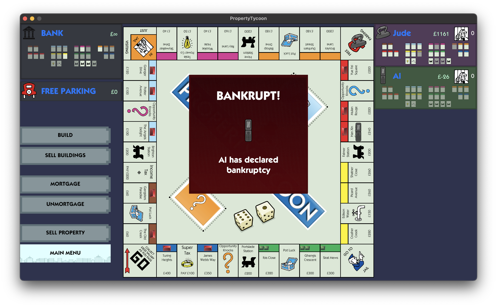

# Property Tycoon

## Overview

A fully featured property trading board game, inspired by Monopoly. Submission for Software Engineering group project, achieving the highest grade in the year ⭐️

**Team**: Jude James, Rudy Pearson, Rohan Shah, Evie Munro, Alex Cunningham-Rojas

## Additional Links

### Documentation hosted here:

[Property Tycoon Docs](https://rohanvshah.me/PropertyTycoonDocs/)

[Source Repository](https://github.com/rshah713/PropertyTycoonDocs)

### AI Simulation hosted here:

[Simulated Monopoly Environment](https://github.com/alexswcr/Monopoly-AI-Training)

## Features

- Play against Bots or with up to 6 players
- AI agent using a neural network
- Custom artwork and music
- Fully editable place names and cards

## Screenshots

|  |  
|--------------|--------------|
|  | 
|  | 
|  | 
|  | 

## Download

Download our implementation of Property Tycoon for MacOS and Windows here.

### Windows

TODO Link here

### MacOS

TODO Link here
